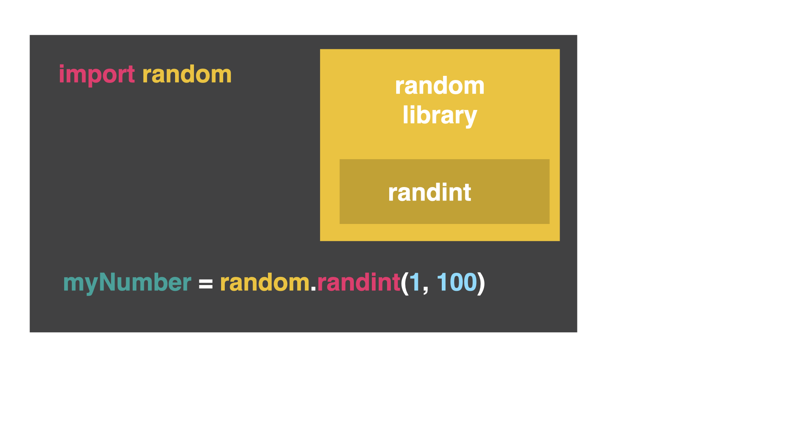

# Common Errors

*First, delete any other code in your `main.py` file. Copy each code snippet below into `main.py` by clicking the copy icon in the top right of each code box. Then, hit `run` and see what errors occur. Fix the errors and press `run` again until you are error free. Click on the `👀 Answer` to compare your code to the correct code.*

## Name Error

👉 Why is this code showing the error of "name not defined?"

```python
import random

myNumber = randint(1, 100)
print(myNumber)
```


<details> <summary> 👀 Answer </summary>

This error is because of the way libraries work. The names of functions and variables in libraries may be similar to the names I chose for my functions and variables. The way to access functions and variables in other libraries is to put `random.` in front of the library name. 



Now the computer knows to "go in the `random` library, find `randint`, and give me a number between 1-100."
  
```python
import random

myNumber = random.randint(1, 100)
print(myNumber)
```
</details>

## Error with random numbers and loops

👉 For this code, I want 10 random numbers between 1-100 printed out. Why is it printing the same number instead of ten *different* random numbers?

```python
import random

myNumber = random.randint(1, 100)
for i in range(10):
  print(myNumber)

```


<details> <summary> 👀 Answer </summary>

The problem is when I am generating my random number, I am doing it *before* the loop. I am asking for one random number and then storing it in a variable. Then, I am saying to `print` out this random number 10 times. Nowhere in the loop am I asking for a new number *each* time. I need to rearrange the order of my code. 


```python
import random

for i in range(10):
  myNumber = random.randint(1, 100)
  print(myNumber)

```
Now, each time the loop resets, it will generate a new random number. Now I can generate 10 random numbers between 1-100.
</details>

